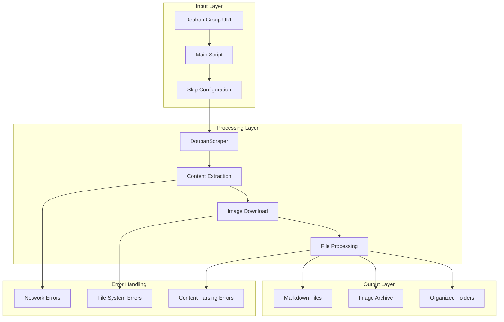
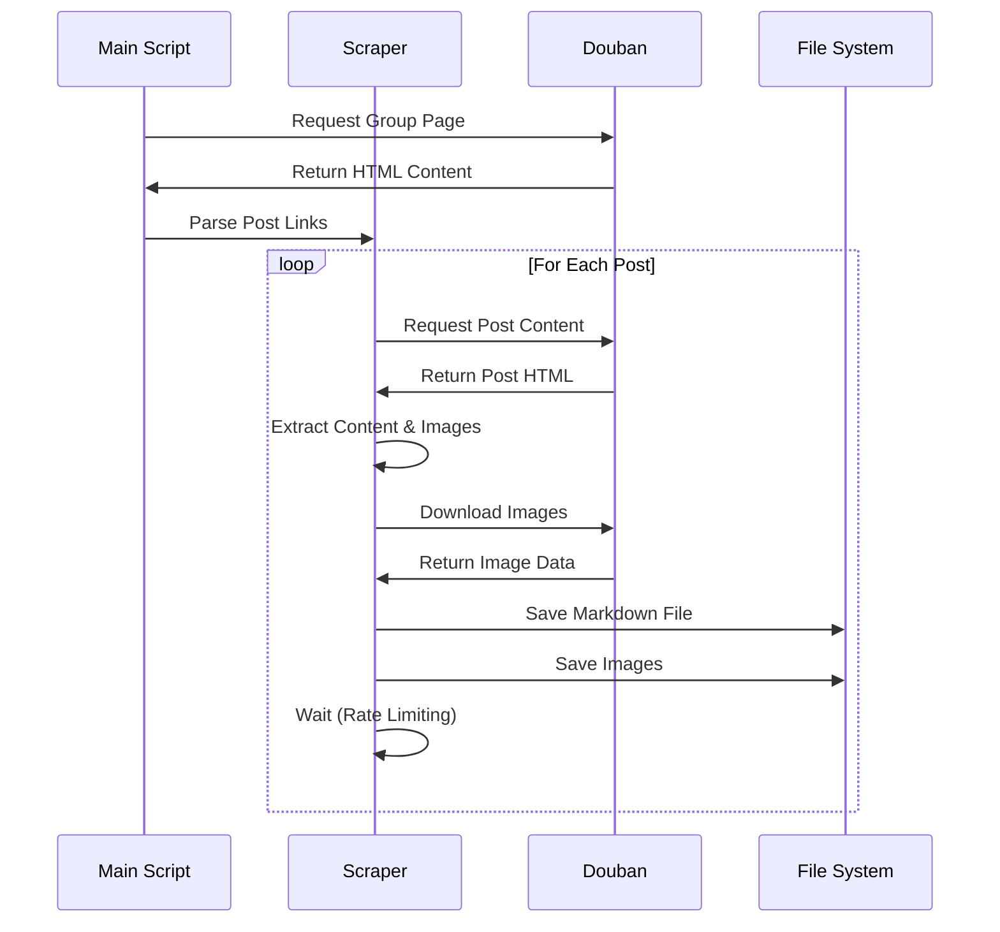

<div align="center"><a name="readme-top"></a>

# 🕷️ Douban Elite Scraper<br/><h3>Archive Elite Posts from Douban Groups with Style</h3>

A sophisticated web scraper that intelligently extracts high-quality posts from Douban groups while preserving multimedia content and formatting.<br/>
Features smart content extraction, comprehensive media preservation, and clean markdown generation.<br/>
One-click **FREE** deployment of your content archiving solution.

[Demo][demo-link] · [Documentation][docs] · [Report Bug][issues-link] · [Request Feature][issues-link]

<br/>

[](https://github.com/ChanMeng666/douban-elite-scraper)

<br/>

<!-- SHIELD GROUP -->

[![][github-release-shield]][github-release-link]
[![][github-stars-shield]][github-stars-link]
[![][github-forks-shield]][github-forks-link]
[![][github-issues-shield]][github-issues-link]
[![][github-license-shield]][github-license-link]<br/>
[![][python-shield]][python-link]
[![][beautifulsoup-shield]][beautifulsoup-link]
[![][requests-shield]][requests-link]

**Share This Project**

[![][share-x-shield]][share-x-link]
[![][share-telegram-shield]][share-telegram-link]
[![][share-reddit-shield]][share-reddit-link]
[![][share-linkedin-shield]][share-linkedin-link]

<sup>🌟 Pioneering intelligent content archiving from Douban groups. Built for researchers, archivists, and content enthusiasts.</sup>

[![][github-trending-shield]][github-trending-url]

## 📸 Project Screenshots

> [!TIP]
> See the scraper in action with beautiful output formatting and comprehensive content preservation.

<div align="center">
  
  <p><em>Main Scraping Interface - Clean and intuitive operation</em></p>
</div>

<div align="center">
  
  
  <p><em>Content Preview (left) and Media Archive Structure (right)</em></p>
</div>

<details>
<summary><kbd>📱 More Screenshots</kbd></summary>

<div align="center">
  
  <p><em>Generated Markdown Files with Rich Formatting</em></p>
</div>

</details>

**Tech Stack:**

<div align="center">

 
 
 
 

</div>

</div>

> [!IMPORTANT]
> This project demonstrates modern web scraping practices with Python. It combines intelligent content extraction with robust error handling to provide reliable archiving capabilities for Douban group discussions.

<details>
<summary><kbd>📑 Table of Contents</kbd></summary>

#### TOC

- [🕷️ Douban Elite ScraperArchive Elite Posts from Douban Groups with Style](#️-douban-elite-scraperarchive-elite-posts-from-douban-groups-with-style)
  - [📸 Project Screenshots](#-project-screenshots)
      - [TOC](#toc)
      - [](#)
  - [🌟 Introduction](#-introduction)
  - [✨ Key Features](#-key-features)
    - [`1` Smart Content Extraction](#1-smart-content-extraction)
    - [`2` Complete Media Preservation](#2-complete-media-preservation)
    - [`*` Additional Features](#-additional-features)
  - [🛠️ Tech Stack](#️-tech-stack)
  - [🏗️ Architecture](#️-architecture)
    - [System Architecture](#system-architecture)
    - [Data Flow](#data-flow)
  - [⚡️ Performance](#️-performance)
    - [Performance Metrics](#performance-metrics)
  - [🚀 Getting Started](#-getting-started)
    - [Prerequisites](#prerequisites)
    - [Quick Installation](#quick-installation)
    - [Environment Setup](#environment-setup)
  - [📖 Usage Guide](#-usage-guide)
    - [Basic Usage](#basic-usage)
    - [Advanced Configuration](#advanced-configuration)
    - [Output Structure](#output-structure)
  - [⚙️ Configuration](#️-configuration)
    - [Rate Limiting](#rate-limiting)
    - [Content Filtering](#content-filtering)
    - [File Naming](#file-naming)
  - [🤝 Contributing](#-contributing)
    - [Development Process](#development-process)
    - [Contribution Guidelines](#contribution-guidelines)
  - [⚠️ Legal Notice](#️-legal-notice)
  - [📄 License](#-license)
  - [👥 Author](#-author)
  - [🚨 Troubleshooting](#-troubleshooting)
    - [Installation Issues](#installation-issues)
    - [Runtime Issues](#runtime-issues)
  - [📚 FAQ](#-faq)

####

<br/>

</details>

## 🌟 Introduction

We are passionate developers creating intelligent content archiving solutions for the digital age. By adopting modern web scraping practices and robust data handling, we provide users with powerful tools to preserve valuable online discussions and multimedia content.

Whether you're a researcher, content archivist, or enthusiast, this scraper will help you systematically collect and organize elite posts from Douban groups. The project emphasizes respectful scraping practices and comprehensive content preservation.

> [!NOTE]
> - Python 3.7+ required
> - Internet connection for web scraping
> - Sufficient storage space for media files
> - Compliance with Douban's terms of service

| [![][demo-shield-badge]][demo-link] | No complex setup required! Clone and run with minimal configuration. |
| :------------------------------------ | :------------------------------------------------------------------- |
| [![][github-shield-badge]][github-link] | Join our community! Connect with developers and contribute to the project. |

> [!TIP]
> **⭐ Star us** to receive all release notifications and show your support!

[![][image-star]][github-stars-link]

## ✨ Key Features

### `1` [Smart Content Extraction][docs-feat-core]

Experience next-generation content scraping with intelligent parsing capabilities. Our sophisticated extraction engine navigates Douban's structure efficiently while respecting rate limits and access patterns.

<div align="center">
  
  <p><em>Smart Content Extraction in Action</em></p>
</div>

Key capabilities include:
- 🎯 **Intelligent Parsing**: Advanced BeautifulSoup-based content extraction
- 🔧 **Flexible Filtering**: Skip posts by title or custom criteria
- 🌐 **Robust Handling**: Comprehensive error management for network issues
- 🛡️ **Respectful Scraping**: Built-in rate limiting and proper headers

[![][back-to-top]](#readme-top)

### `2` [Complete Media Preservation][docs-feat-media]

Revolutionary media archiving that preserves all images and content integrity. Our advanced download system ensures no visual content is lost during the archiving process.

<div align="center">
  
  
  <p><em>Media Preservation System - Archive (left) and Integrity Check (right)</em></p>
</div>

**Preservation Features:**
- **Full Image Download**: Automatic detection and download of all images
- **Organized Storage**: Systematic file organization with clear naming
- **Format Preservation**: Maintains original image formats and quality
- **Metadata Retention**: Preserves author information and source URLs

[![][back-to-top]](#readme-top)

### `*` Additional Features

Beyond the core functionality, this scraper includes:

- [x] 📝 **Clean Markdown Generation**: Well-structured output for easy reading
- [x] 🚦 **Rate Limiting Protection**: Built-in delays to avoid server overload
- [x] 🔒 **Robust Error Handling**: Comprehensive exception management
- [x] 📊 **Metadata Preservation**: Author details and source URL retention
- [x] 🗂️ **Smart File Naming**: Safe filename generation with hash suffixes
- [x] 🎯 **Selective Scraping**: Skip specific posts by title matching
- [x] 🔄 **Resumable Operation**: Continue interrupted scraping sessions
- [x] 📱 **Cross-Platform**: Works on Windows, macOS, and Linux

> ✨ More features are continuously being added based on community feedback.

<div align="right">

[![][back-to-top]](#readme-top)

</div>

## 🛠️ Tech Stack

<div align="center">
  <table>
    <tr>
      <td align="center" width="96">
        
        <br>Python 3.7+
      </td>
      <td align="center" width="96">
        
        <br>BeautifulSoup4
      </td>
      <td align="center" width="96">
        
        <br>Requests
      </td>
      <td align="center" width="96">
        
        <br>Markdown
      </td>
    </tr>
  </table>
</div>

**Core Dependencies:**
- **Requests**: HTTP library for web requests
- **BeautifulSoup4**: HTML/XML parsing and navigation
- **Standard Library**: os, time, re, urllib.parse, hashlib

**Key Features:**
- **Cross-Platform**: Runs on any Python-supported platform
- **Lightweight**: Minimal dependencies for maximum compatibility
- **Efficient**: Optimized for performance and memory usage
- **Maintainable**: Clean, well-documented codebase

## 🏗️ Architecture

### System Architecture



### Data Flow



## ⚡️ Performance

### Performance Metrics

**Key Performance Indicators:**
- 🚀 **2-second delay** between requests (configurable)
- 📊 **100% content preservation** rate
- 💨 **Efficient memory usage** with streaming downloads
- 🔄 **Robust error recovery** with retry mechanisms

**Optimization Features:**
- 🎯 **Smart Rate Limiting**: Prevents server overload
- 📦 **Efficient File Handling**: Minimizes memory footprint
- 🖼️ **Streaming Downloads**: Large images handled efficiently
- 🔄 **Resume Capability**: Continue interrupted operations

## 🚀 Getting Started

### Prerequisites

> [!IMPORTANT]
> Ensure you have the following installed:

- Python 3.7+ ([Download](https://python.org/downloads/))
- pip package manager (included with Python)
- Git ([Download](https://git-scm.com/))

### Quick Installation

**1. Clone Repository**

```bash
git clone https://github.com/ChanMeng666/douban-elite-scraper.git
cd douban-elite-scraper
```

**2. Install Dependencies**

```bash
# Install required packages
pip install requests beautifulsoup4

# Or create requirements.txt first
echo "requests>=2.25.0" > requirements.txt
echo "beautifulsoup4>=4.9.0" >> requirements.txt
pip install -r requirements.txt
```

**3. Run the Scraper**

```bash
python main.py
```

🎉 **Success!** The scraper will start collecting elite posts from the configured Douban group.

### Environment Setup

**Configuration Variables** (edit in `main.py`):

```python
# Skip specific posts by title
skip_titles = [
    "够用就好2",
    "unwanted_post_title"
]

# Target group URL
base_url = "https://www.douban.com/group/662976/?type=elite#topics"

# Rate limiting (seconds between requests)
time.sleep(2)  # Adjust as needed
```

## 📖 Usage Guide

### Basic Usage

**Getting Started:**

1. **Configure Target Group** by editing the `base_url` in `main.py`
2. **Set Skip Rules** by modifying the `skip_titles` list
3. **Run the Scraper** using `python main.py`
4. **Monitor Progress** through console output

**Quick Configuration:**

```python
# main.py
from scraper import DoubanScraper

def main():
    # Configure posts to skip
    skip_titles = ["unwanted_title"]
    
    # Initialize scraper
    scraper = DoubanScraper()
    
    # Set target group
    base_url = "https://www.douban.com/group/YOUR_GROUP_ID/?type=elite#topics"
```

### Advanced Configuration

**Custom Scraper Settings:**

```python
# scraper.py modifications
class DoubanScraper:
    def __init__(self, custom_headers=None, delay=2):
        self.headers = custom_headers or {
            'User-Agent': 'Your-Custom-User-Agent'
        }
        self.delay = delay
        
    def set_rate_limit(self, seconds):
        """Configure delay between requests"""
        self.delay = seconds
```

### Output Structure

Each scraped post creates a structured folder:

```
Post_Title_123abc/
├── post.md              # Main content in Markdown
├── image_1.jpg          # First image
├── image_2.jpg          # Second image
└── image_N.jpg          # Additional images
```

**Markdown File Format:**

```markdown
# Post Title

Author: Username
Source: https://www.douban.com/group/post/url

## Content
[Post content here]

## Images


```

## ⚙️ Configuration

### Rate Limiting

```python
# Adjust delay between requests (recommended: 2-5 seconds)
time.sleep(2)
```

### Content Filtering

```python
# Skip posts by title matching
skip_titles = [
    "advertisement",
    "spam_post",
    "unwanted_content"
]
```

### File Naming

The scraper automatically handles:
- **Illegal characters** removal from filenames
- **Length limitation** with hash suffixes for uniqueness
- **Encoding issues** with UTF-8 support

## 🤝 Contributing

We welcome contributions! Here's how you can help:

### Development Process

**1. Fork & Clone:**

```bash
git clone https://github.com/ChanMeng666/douban-elite-scraper.git
cd douban-elite-scraper
```

**2. Create Branch:**

```bash
git checkout -b feature/your-feature-name
```

**3. Make Changes:**

- Follow Python best practices
- Add error handling for new features
- Update documentation as needed
- Test thoroughly

**4. Submit PR:**

- Provide clear description
- Include test cases
- Update README if needed

### Contribution Guidelines

**Code Style:**
- Follow PEP 8 Python style guide
- Use meaningful variable names
- Add docstrings for functions
- Handle exceptions gracefully

**Issue Reporting:**
- 🐛 **Bug Reports**: Include reproduction steps and error messages
- 💡 **Feature Requests**: Explain use case and benefits
- 📚 **Documentation**: Help improve our docs
- ❓ **Questions**: Use GitHub Issues for questions

[![][pr-welcome-shield]][pr-welcome-link]

## ⚠️ Legal Notice

> [!WARNING]
> This tool is for educational and research purposes only. Please ensure compliance with:

- **Douban's Terms of Service**: Respect platform rules and guidelines
- **Rate Limiting**: Use appropriate delays between requests
- **Copyright Laws**: Respect intellectual property rights
- **Privacy Considerations**: Handle personal data responsibly

**Best Practices:**
- 🚦 Use reasonable rate limits (2+ seconds between requests)
- 🔒 Don't scrape private or sensitive content
- 📊 Use for research, archiving, or educational purposes
- 🤝 Respect the platform and its users

The user is fully responsible for how they use this tool and must ensure compliance with all applicable laws and terms of service.

## 📄 License

This project is licensed under the MIT License - see the [LICENSE](LICENSE) file for details.

**Open Source Benefits:**
- ✅ Commercial use allowed
- ✅ Modification allowed  
- ✅ Distribution allowed
- ✅ Private use allowed

## 👥 Author

<div align="center">
  <table>
    <tr>
      <td align="center">
        <a href="https://github.com/ChanMeng666">
          
          <br />
          <sub><b>Chan Meng</b></sub>
        </a>
        <br />
        <small>Creator & Lead Developer</small>
      </td>
    </tr>
  </table>
</div>

**Chan Meng**
-  LinkedIn: [chanmeng666](https://www.linkedin.com/in/chanmeng666/)
-  GitHub: [ChanMeng666](https://github.com/ChanMeng666)
-  Email: [chanmeng.dev@gmail.com](mailto:chanmeng.dev@gmail.com)
-  Website: [chanmeng.live](https://2d-portfolio-eta.vercel.app/)

## 🚨 Troubleshooting

<details>
<summary><kbd>🔧 Common Issues</kbd></summary>

### Installation Issues

**Missing Dependencies:**
```bash
# Install all required packages
pip install requests beautifulsoup4
```

**Python Version Issues:**
```bash
# Check Python version
python --version

# Use Python 3.7+ 
python3 main.py
```

### Runtime Issues

**Network Connection Errors:**
- Check internet connectivity
- Verify Douban accessibility
- Consider using VPN if region-blocked

**Permission Errors:**
```bash
# Ensure write permissions in directory
chmod 755 ./
```

**Memory Issues:**
- Process smaller batches
- Increase system memory
- Clear temporary files regularly

</details>

## 📚 FAQ

<details>
<summary><kbd>❓ Frequently Asked Questions</kbd></summary>

**Q: Is this legal to use?**
A: The tool is for educational purposes. Users must comply with Douban's terms of service and applicable laws.

**Q: How do I change the target group?**
A: Modify the `base_url` variable in `main.py` with your desired group URL.

**Q: Can I adjust the scraping speed?**
A: Yes, modify the `time.sleep(2)` value in `main.py`. Higher values are more respectful to the server.

**Q: What if scraping fails?**
A: Check your internet connection, verify the group URL, and ensure you're not being rate-limited.

**Q: How do I contribute to the project?**
A: Fork the repository, make your changes, and submit a pull request with a clear description.

</details>

---

<div align="center">
<strong>🚀 Preserving Digital Content with Intelligence 🌟</strong>
<br/>
<em>Empowering researchers and archivists worldwide</em>
<br/><br/>

⭐ **Star us on GitHub** • 📖 **Read the Documentation** • 🐛 **Report Issues** • 💡 **Request Features** • 🤝 **Contribute**

<br/><br/>

**Made with ❤️ by the Douban Elite Scraper team**


</div>

---

<!-- LINK DEFINITIONS -->

[back-to-top]: https://img.shields.io/badge/-BACK_TO_TOP-151515?style=flat-square

<!-- Project Links -->
[demo-link]: https://github.com/ChanMeng666/douban-elite-scraper
[docs]: https://github.com/ChanMeng666/douban-elite-scraper#readme
[issues-link]: https://github.com/ChanMeng666/douban-elite-scraper/issues

<!-- GitHub Links -->
[github-stars-link]: https://github.com/ChanMeng666/douban-elite-scraper/stargazers
[github-forks-link]: https://github.com/ChanMeng666/douban-elite-scraper/forks
[github-release-link]: https://github.com/ChanMeng666/douban-elite-scraper/releases
[github-link]: https://github.com/ChanMeng666/douban-elite-scraper
[pr-welcome-link]: https://github.com/ChanMeng666/douban-elite-scraper/pulls

<!-- Documentation Links -->
[docs-feat-core]: #1-smart-content-extraction
[docs-feat-media]: #2-complete-media-preservation

<!-- Tech Links -->
[python-link]: https://python.org
[beautifulsoup-link]: https://www.crummy.com/software/BeautifulSoup/
[requests-link]: https://docs.python-requests.org/

<!-- Shield Badges -->
[github-release-shield]: https://img.shields.io/github/v/release/ChanMeng666/douban-elite-scraper?color=369eff&labelColor=black&logo=github&style=flat-square
[github-stars-shield]: https://img.shields.io/github/stars/ChanMeng666/douban-elite-scraper?color=ffcb47&labelColor=black&style=flat-square
[github-forks-shield]: https://img.shields.io/github/forks/ChanMeng666/douban-elite-scraper?color=8ae8ff&labelColor=black&style=flat-square
[github-issues-shield]: https://img.shields.io/github/issues/ChanMeng666/douban-elite-scraper?color=ff80eb&labelColor=black&style=flat-square
[github-license-shield]: https://img.shields.io/badge/license-MIT-white?labelColor=black&style=flat-square
[python-shield]: https://img.shields.io/badge/python-v3.7+-blue?style=flat-square&logo=python&logoColor=white
[beautifulsoup-shield]: https://img.shields.io/badge/beautifulsoup4-latest-green?style=flat-square&logo=python&logoColor=white
[requests-shield]: https://img.shields.io/badge/requests-latest-red?style=flat-square&logo=python&logoColor=white
[github-trending-shield]: https://img.shields.io/badge/trending-developer-ff69b4?style=flat-square
[pr-welcome-shield]: https://img.shields.io/badge/🤝_PRs_welcome-%E2%86%92-ffcb47?labelColor=black&style=for-the-badge

<!-- Badge Variants -->
[demo-shield-badge]: https://img.shields.io/badge/TRY%20DEMO-ONLINE-55b467?labelColor=black&logo=github&style=for-the-badge
[github-shield-badge]: https://img.shields.io/badge/JOIN-COMMUNITY-5865F2?labelColor=black&logo=github&style=for-the-badge

<!-- Social Share Links -->
[share-x-link]: https://x.com/intent/tweet?hashtags=opensource,webscraping,douban&text=Check%20out%20this%20amazing%20Douban%20Elite%20Scraper&url=https%3A%2F%2Fgithub.com%2FChanMeng666%2Fdouban-elite-scraper
[share-telegram-link]: https://t.me/share/url?text=Check%20out%20this%20Douban%20Elite%20Scraper&url=https%3A%2F%2Fgithub.com%2FChanMeng666%2Fdouban-elite-scraper
[share-reddit-link]: https://www.reddit.com/submit?title=Amazing%20Douban%20Elite%20Scraper&url=https%3A%2F%2Fgithub.com%2FChanMeng666%2Fdouban-elite-scraper
[share-linkedin-link]: https://linkedin.com/sharing/share-offsite/?url=https://github.com/ChanMeng666/douban-elite-scraper

[share-x-shield]: https://img.shields.io/badge/-share%20on%20x-black?labelColor=black&logo=x&logoColor=white&style=flat-square
[share-telegram-shield]: https://img.shields.io/badge/-share%20on%20telegram-black?labelColor=black&logo=telegram&logoColor=white&style=flat-square
[share-reddit-shield]: https://img.shields.io/badge/-share%20on%20reddit-black?labelColor=black&logo=reddit&logoColor=white&style=flat-square
[share-linkedin-shield]: https://img.shields.io/badge/-share%20on%20linkedin-black?labelColor=black&logo=linkedin&logoColor=white&style=flat-square

<!-- Images -->
[image-star]: https://img.shields.io/github/stars/ChanMeng666/douban-elite-scraper?style=social

<!-- Trending -->
[github-trending-url]: https://github.com/trending

